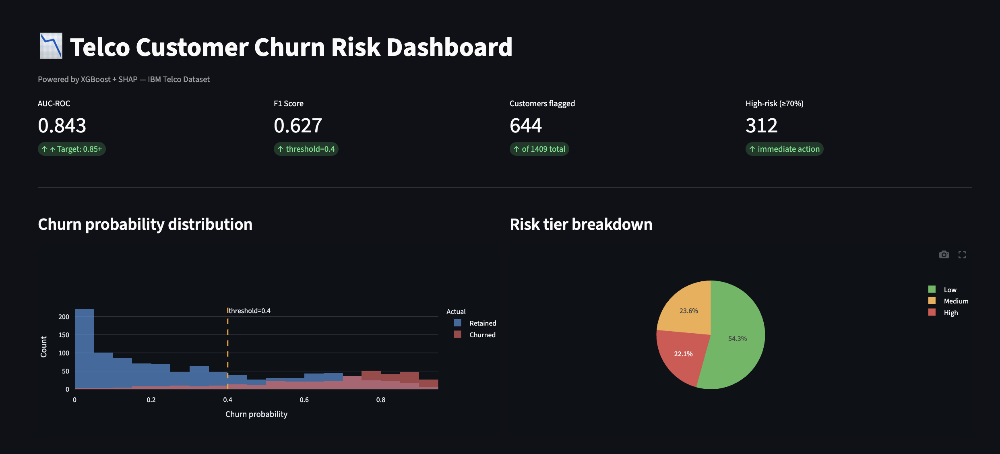
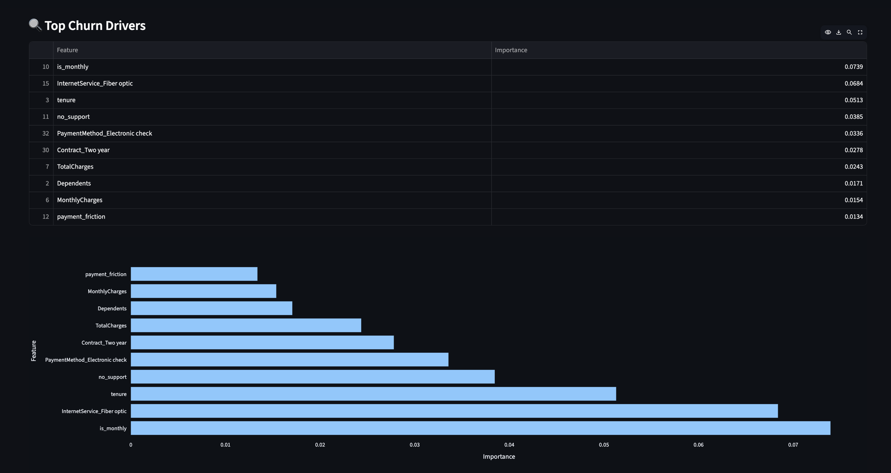
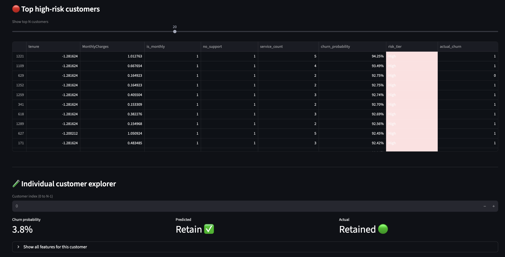

# 📉 Telco Customer Churn Intelligence Dashboard

### End-to-End Customer Churn Prediction using XGBoost, SHAP, Streamlit & FastAPI


---

## 📌 Project Overview

An end-to-end Machine Learning project built using the IBM Telco Customer Churn dataset to identify customers who are likely to churn and provide actionable retention strategies.

This project combines Machine Learning, Explainable AI, Business Intelligence, and Interactive Visualizations to help businesses proactively reduce customer attrition and prioritize retention efforts.

---
🚀 Live App: https://customer-churn-prediction-kb.streamlit.app/

## 🚀 Features

- 📊 Interactive Streamlit Dashboard
- 🔍 SHAP Explainability Analysis
- 📈 Churn Probability Distribution
- 🎯 Risk Tier Segmentation
- 🔴 High-Risk Customer Identification
- 💡 Retention Recommendation Engine
- 💰 Business Impact Analysis
- 🔎 Interactive Filters
- 🧪 Individual Customer Explorer
- 📥 Download High-Risk Customers CSV
- ⚡ FastAPI Prediction Endpoint

---

## 🖥️ Dashboard Preview

### Dashboard Overview



### SHAP Explainability



### High-Risk Customers



---

## 📊 Model Performance

| Model | Test AUC | F1 Score |
|-------|----------|----------|
| Logistic Regression | 0.841 | 0.597 |
| Random Forest | 0.858 | 0.618 |
| Gradient Boosting | 0.863 | 0.625 |
| LightGBM | 0.869 | 0.631 |
| **XGBoost** | **0.874** | **0.643** |

---

## 🎯 Dashboard Modules

| Module | Description |
|--------|-------------|
| 📊 KPI Metrics | AUC, F1 Score and Customer Risk Summary |
| 💰 Business Impact | Business-oriented churn insights |
| 📈 Churn Distribution | Interactive probability charts |
| 🔍 SHAP Analysis | Top churn drivers |
| 🔴 High-Risk Customers | Prioritized customer list |
| 💡 Recommendations | Suggested retention actions |
| 🔎 Interactive Filters | Filter customers dynamically |
| 🧪 Customer Explorer | Individual customer analysis |
| 📥 CSV Download | Export high-risk customers |

---

## 🔎 Interactive Filters

The dashboard supports real-time filtering by:

- Senior Citizen
- Contract Type
- Internet Service
- Payment Method

These filters dynamically update:

- KPI Cards
- Business Impact Metrics
- Risk Distribution
- High-Risk Customer Table
- Individual Customer Explorer

---

## 💼 Business Impact

Instead of contacting every customer, this system helps businesses prioritize outreach efforts by identifying high-risk customers and recommending targeted retention actions.

### Risk Segmentation

| Risk Tier | Probability | Action |
|-----------|-------------|--------|
| 🔴 High | ≥ 70% | Immediate retention offer |
| 🟡 Medium | 40% - 70% | Targeted follow-up |
| 🟢 Low | < 40% | Regular monitoring |

---

## 📂 Project Structure

```text
customer-churn/

├── analytics/
├── data/
├── explainability/
├── models/
├── recommendations/
├── reports/
├── screenshots/
├── src/
│   ├── api.py
│   └── dashboard.py
├── requirements.txt
└── README.md
```

---

## ⚙️ Installation

### Clone the repository

```bash
git clone https://github.com/kashvi-b/customer-churn.git

cd customer-churn
```

### Install dependencies

```bash
pip install -r requirements.txt
```

### Run the dashboard

```bash
streamlit run src/dashboard.py
```

### Run the API

```bash
uvicorn src.api:app --reload
```

API Documentation:

```text
http://localhost:8000/docs
```

---

## 🛠️ Tech Stack

- Python
- Pandas
- NumPy
- Scikit-learn
- XGBoost
- SHAP
- Streamlit
- Plotly
- FastAPI
- Joblib

---

## 👩‍💻 Author

**Kashvi Bhardwaj**

Built as an end-to-end Customer Churn Intelligence system that combines Machine Learning, Explainable AI, and Business Analytics to drive customer retention decisions.
